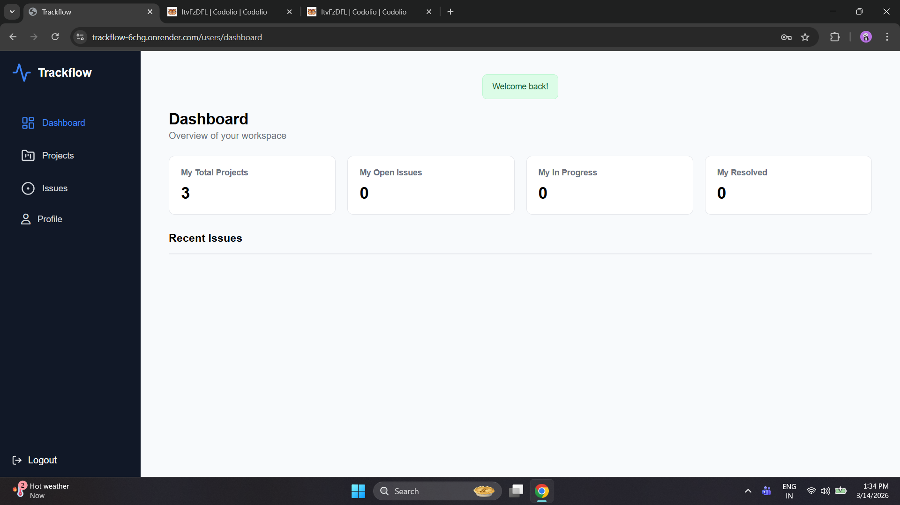
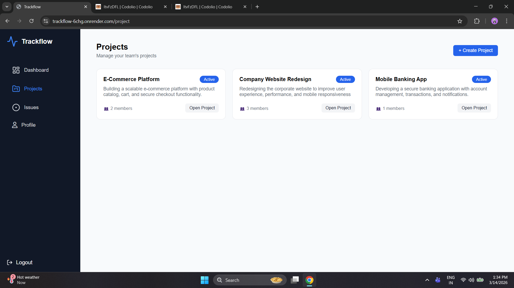
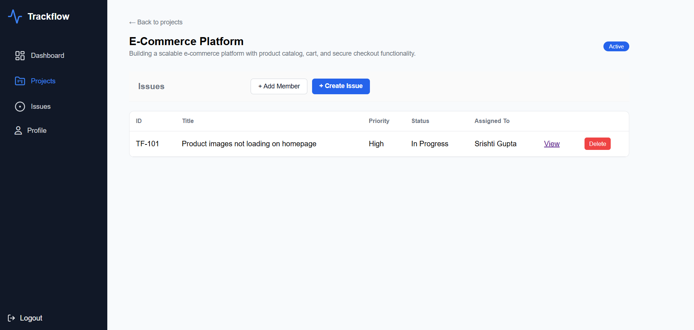
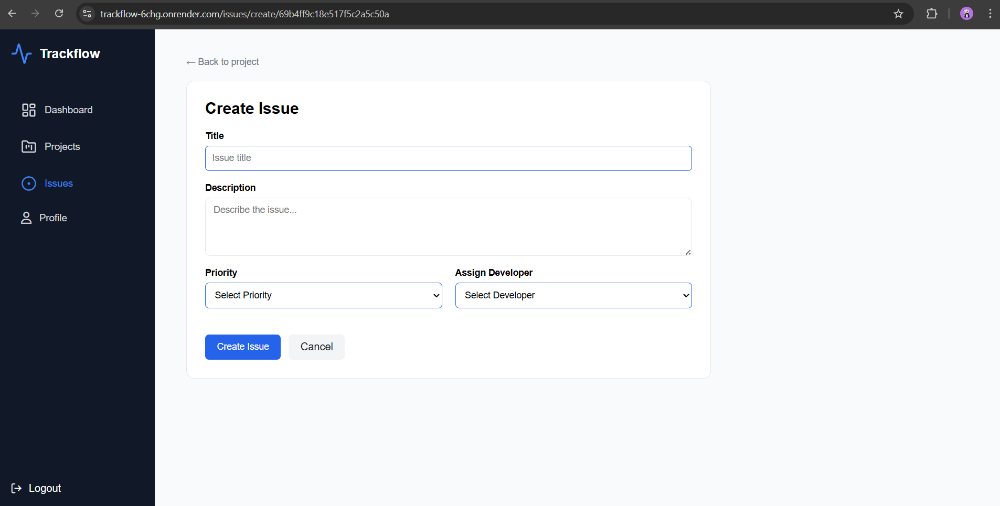
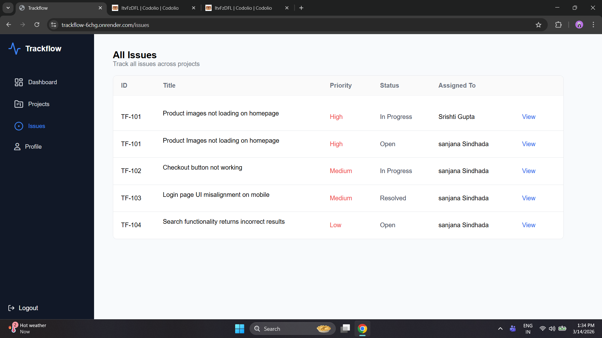
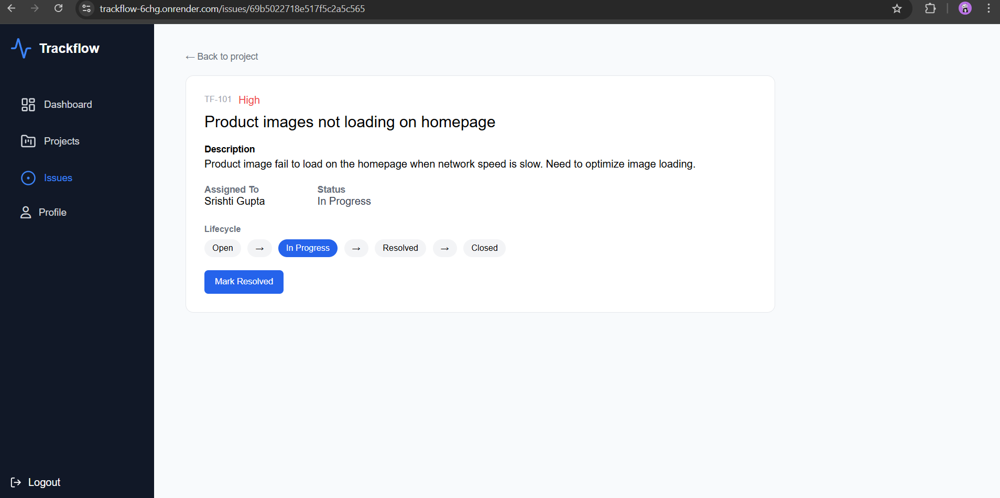
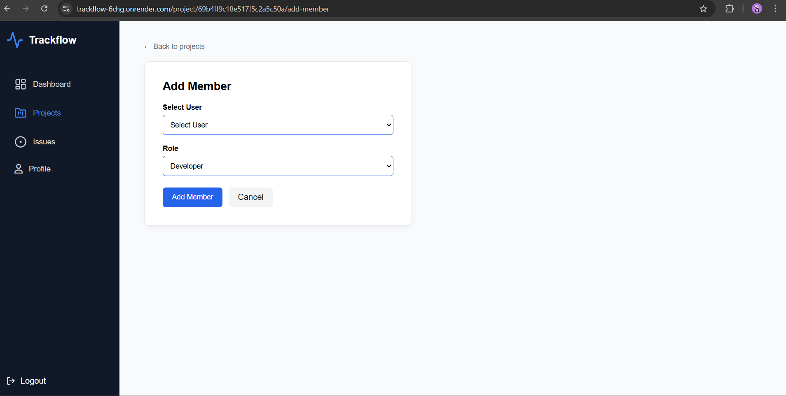
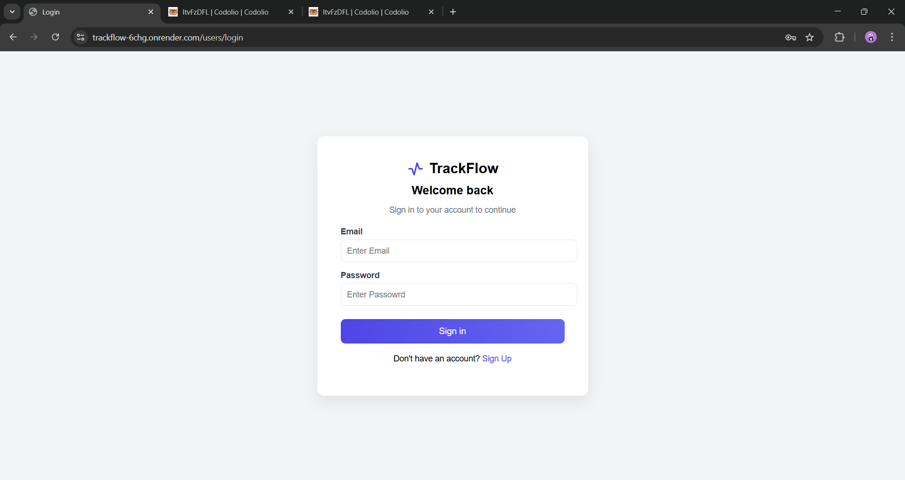
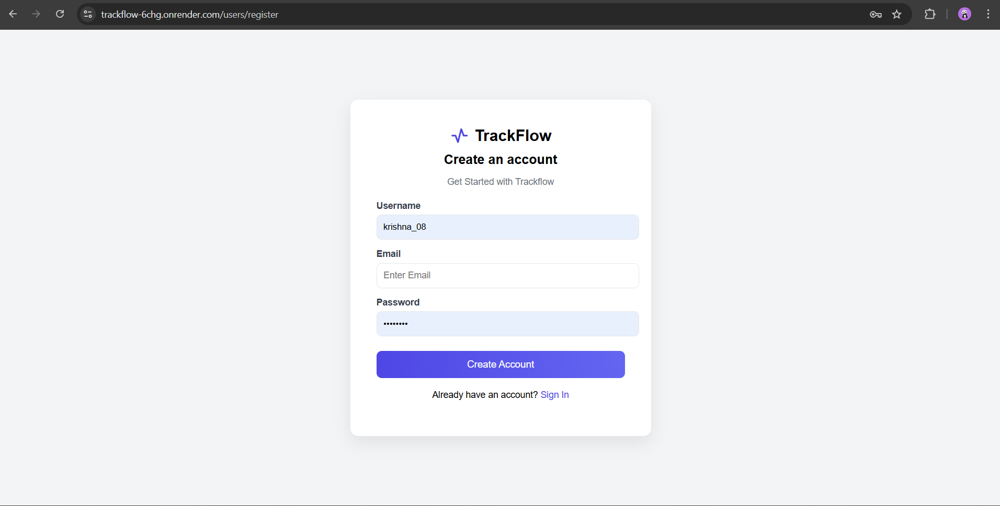
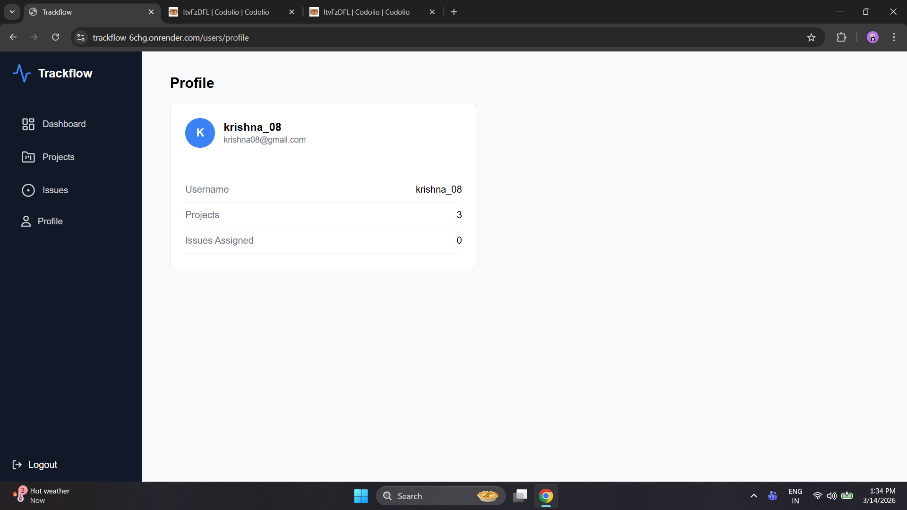

# TrackFlow 🚀

TrackFlow is a full-stack issue tracking system designed to help teams manage projects and track bugs efficiently.

It allows users to create projects, assign members, manage issues, and track issue lifecycle from **Open → In Progress → Resolved → Closed**.

---

## 🌐 Live Demo
https://trackflow-6chg.onrender.com

---

## ✨ Features

• User Authentication (Register / Login)

• Create and manage projects

• Add members to projects with roles  
(Admin / Developer / Tester)

• Create issues and assign developers

• Issue lifecycle management

Open → In Progress → Resolved → Closed

• Dashboard showing:

- Total projects
- Open issues
- Issues in progress
- Resolved issues
- Recent issues list

• Profile page for user overview

• Flash messages for actions

• Responsive sidebar layout

---

## 🛠 Tech Stack

**Frontend**
- HTML
- CSS
- EJS

**Backend**
- Node.js
- Express.js

**Database**
- MongoDB Atlas
- Mongoose

**Authentication**
- Express Session
- Bcrypt

**Deployment**
- Render

---

## 📂 Project Structure

Trackflow │ ├── controllers ├── models ├── routes ├── views ├── public │ ├── app.js └── package.json

---

## ⚙️ Installation

Clone the repository
git clone https://github.com/YOURUSERNAME/trackflow.git⁠�

Install dependencies
npm install
Create `.env` file
MONGO_URL=your_mongodb_url SESSION_SECRET=your_secret
Run server
node app.js
Open in browser
http://localhost:3000

---

## 📸 Screenshots

## 📸 Screenshots

### Dashboard

### Projects Page

### Project Detail Page

### Create Issue Page

### All Issues Page

### Issue Update Page

### Add Member Page

### Login Page

### Register Page

### Profile Page

---

## 🚀 Future Improvements

• Real-time notifications

• Comments on issues

• File attachments

• Activity logs

• Email notifications

• React frontend (MERN version)

---

## 👩‍💻 Author

Srishti Gupta
